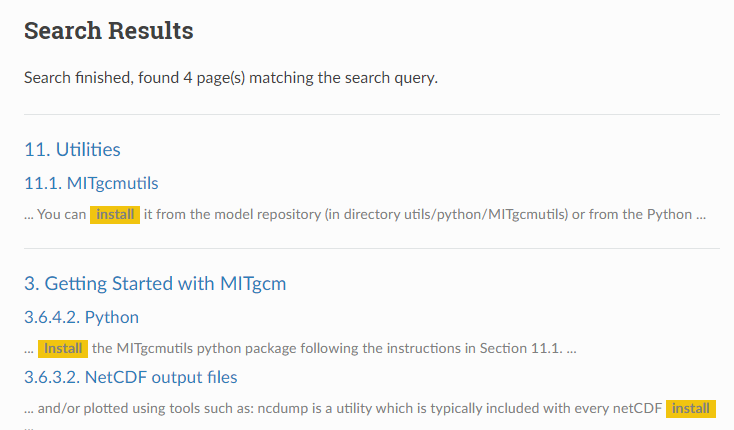

RecurDyn Issue
##############

Search
******

PC serach result

Readthedocs result

Not easy to implement PC search result as Readthedocs result

PDF
***

GIF support
===========

edit conf.py

.. code-block::

    #https://stackoverflow.com/questions/45969711/sphinx-doc-how-do-i-render-an-animated-gif-when-building-for-html-but-a-png-wh
    from sphinx.builders.html import StandaloneHTMLBuilder
    StandaloneHTMLBuilder.supported_image_types = [
        'image/svg+xml',
        'image/gif',
        'image/png',
        'image/jpeg'
    ]

edit \*.rst

.. code-block::

    change ???.gif to ???.png

convert \*.gif to \*.png ( it's done when converting docx )

Image
*****

Convert image to png
====================

convert \*.gif, \*.jpg, \*.bmp to \*.png ( it's done when converting docx )

Reference to Other document
***************************

edit conf.py

.. code-block::

    extensions = [
    'sphinx.ext.autosectionlabel',
    ]
    autosectionlabel_prefix_document = True

Options
=======

.. code-block::

    autosectionlabel_prefix_document = True

    :ref:`20_TSG/20_TSG:TSG Overview` 
    :ref:`custom title <20_TSG/20_TSG:TSG Overview>` 

    autosectionlabel_prefix_document = False

    :ref:`TSG Overview` 
    :ref:`custom title <TSG Overview>` 

RecurDyn uses 
    autosectionlabel_prefix_document = True

Example

.. code-block::

    Docx
    Click `here <Working_Plane_Setup>`__.
    Click `here <06_Body.docx#Use_Advanced_Graphical_Quality>`__.

    RST
    Click :ref:`here <03_home/03_home:Working Plane Setup>` 
    Click here :ref:`06_Body/06_Body:Use Advanced Graphical Quality>`.

Sphinx Build Wranings
*********************

WARNING: Inline emphasis start-string without end-string.
=========================================================

.. code-block::

    edit *.rst
    =>
    edit \*.rst

    “*EIG_0001.RAN”, “*EIG_0002.RAN” and “*EIG_0003.RAN”.)
    =>
    “\*EIG_0001.RAN”, “\*EIG_0002.RAN” and “\*EIG_0003.RAN”.)

WARNING: Inline strong start-string without end-string.
=======================================================

.. code-block::

    the user can refer it in the directory (<install dir>/Help/DP_Study/**).
    =>
    the user can refer it in the directory (<install dir>/Help/DP_Study/\*\*).

WARNING: Error in "code-block" directive
========================================

.. code-block::

    .. code-block::
        change ???.gif to ???.png
    =>
    .. code-block::

        change ???.gif to ???.png

WARNING: Title level inconsistent
=================================

When converting 05_Analysis.docx, occurs level mismatch

.. code-block::
        
    Analysis
    ========

    Dyn/Kin (Dynamic/Kinematic)
    ---------------------------

    Property
    ^^^^^^^^

    Parameter Page
    ''''''''''''''

    Static
    ------

    Property
    ~~~~~~~~

    Parameter Page
    ^^^^^^^^^^^^^^

WARNING: Inline interpreted text or phrase reference start-string without end-string.
=====================================================================================

.. code-block::

    :math:`\zeta `
    =>
    :math:`\zeta`

    :math:`{{f}_{n}}\equiv \sqrt{{{\lambda }'}}/2\pi `[Hz] (16-1)
    =>
    :math:`{{f}_{n}}\equiv \sqrt{{{\lambda }'}}/2\pi` [Hz] (16-1)

    :math:`{{f}_{n}}\equiv \sqrt{{{\lambda }'}}/2\pi`[Hz] (16-1)
    =>
    :math:`{{f}_{n}}\equiv \sqrt{{{\lambda }'}}/2\pi` [Hz] (16-1)

    where :math:`{{\lambda }_{r}}=-{{\omega }_{n}}\zeta`, |image8|
    =>
    where :math:`{{\lambda }_{r}}=-{{\omega }_{n}}\zeta` , |image8|

ProcessWord Issue
#################

Equation Convert
****************

Not supporting eq (1-1) (1-2) type. => fixed in ProcessWord.exe

.. code-block::

    <eq047> (16-2)
    =>
    .. :math:`equation`
        label: 05_ana_eq046

Not supporting eq (1-1) (1-2) type. => User need to fix

.. code-block::

    <eq047>[Hz] (16-1)
    =>
    .. :math:`equation Hz`
        label: 05_ana_eq047

    <eq048>, |image001| (16-2)
    =>
    .. :math:`equation edit`
        label: 05_ana_eq048

MathType Convert
****************

When converting equation to NULL, kill mathtype.exe process and rerun ProcessWord.exe
8